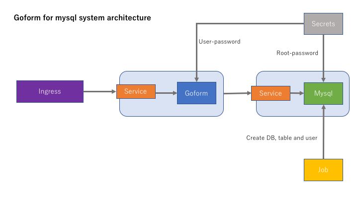

# goform for mysql

Goform is the tiny application program for kubernetes action test.  
This application program confirms operation in following environment.

```
Docker version 17.09.0-ce(local enviroment)
go version go1.9.2
kubernetes mster/nodes(GKE) v1.7.8-gke.0
MySQL Community Server 5.7.20
ubuntu16.04
```




## Installation flow

1. Create GKE Cluster
1. Create database password
1. Create secrets
1. Create pods
1. Create services
1. Create job
1. Create ingress

※ Deleting the mysql pod deletes the data.

---

Create kubernetes cluster with your account.  
How to make GCP web console, gcloud commands and [Terraform](https://github.com/s-ari/tools/blob/master/terraform/gcp/gke_cluster/README.md).

---

A work directory is the manifest directory.  
Register secret befor create mysql root password and user password.

```
cd manifest
echo -n "<ROOT_PASSWORD>" > /tmp/root-password
kubectl create secret generic root-password --from-file=/tmp/root-password
echo -n "<USER_PASSWORD" > /tmp/user-password
kubectl create secret generic user-password --from-file=/tmp/user-password
```

Check registration secrets.
```
kubectl get secrets
NAME                  TYPE                                  DATA      AGE
default-token-6qp0s   kubernetes.io/service-account-token   3         17m
root-password         Opaque                                1         29s
user-password         Opaque                                1         6s

kubectl describe secrets/root-password
Name:         root-password
Namespace:    default
Labels:       <none>
Annotations:  <none>

Type:  Opaque

Data
====
root-password:  8 bytes

kubectl describe secrets/user-password
Name:         user-password
Namespace:    default
Labels:       <none>
Annotations:  <none>

Type:  Opaque

Data
====
user-password:  8 bytes

```

Create goform pods and mysql pod with a deployment.  

```
kubectl create -f deployment.yaml
kubectl get pods
NAME                                READY     STATUS    RESTARTS   AGE
goform-deployment-960104384-bvj5j   1/1       Running   0          31s
mysql-880290682-b9d75               1/1       Running   0          31s
```

Create services for goform and mysql.  
Goform deploys nodeport.

```
kubectl create -f service.yaml
kubectl get service
NAME         TYPE        CLUSTER-IP      EXTERNAL-IP   PORT(S)          AGE
goform-sql   NodePort    10.27.248.190   <none>        8080:30000/TCP   11s
kubernetes   ClusterIP   10.27.240.1     <none>        443/TCP          24m
mysql        ClusterIP   10.27.240.251   <none>        3306/TCP         10s
```

Create job.  
This job is creating database, table and mysql user.  
Pleas you should check job status of SUCCESSFUL.

```
kubectl get job
NAME      DESIRED   SUCCESSFUL   AGE
dbjob     1         1            6s
```

Create ingress.

```
kubectl create -f ingress.yaml
kubectl get ingress
NAME            HOSTS     ADDRESS   PORTS     AGE
basic-ingress   *                   80        15s
```

Waiting for about 5 minute.  
Access to http://[YOUR EXTERNALIP]

## Additional

* [goform container image pulls from my docker hub.](https://hub.docker.com/r/arimas/goform_sql/)
* In the case of create docker image, to rebuild Dockerfile.
* In the case of create goform binary, to rebuid main.go.

goform builld
```
go build -o goform_sql main.go
```

Dockerfile build
```
docker build . -t arimas/goform_sql
```

