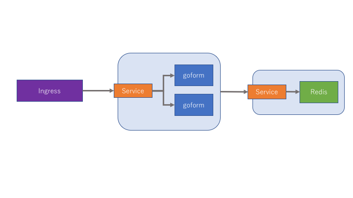

# goform

Goform is the tiny application program for kubernetes action test.  
This application program confirms operation in following environment.

```
Docker version 17.09.0-ce(local enviroment)
go version go1.9.2
kubernetes mster/nodes(GKE) v1.7.8-gke.0
redis_version 2.8.19
ubuntu16.04
```




## Installation

1. Create GKE Cluster
1. Deploy pods
1. Create Services
1. Create Ingress

※ Deleting the redis pod deletes the data.

---

Create kubernetes cluster with your account.  
How to make GCP web console, gcloud commands and [Terraform](https://github.com/s-ari/tools/blob/master/terraform/gcp/gke_cluster/README.md).

---

Deploy goform pods and redis pod with a deployment.  
But I was refarenced GCP site about [redis pods and service](https://cloud.google.com/kubernetes-engine/docs/tutorials/guestbook?hl=ja).

```
kubectl create -f deployment.yaml
kubectl get pods
NAME                                READY     STATUS    RESTARTS   AGE
goform-deployment-305796951-mxdwl   1/1       Running   0          2h
goform-deployment-305796951-w8903   1/1       Running   0          10m
redis-3759951617-tgwbt              1/1       Running   0          8h
```

Create services for gorom and redis.  
Goform deploys nodeport.

```
kubectl create -f service.yaml
kubectl get service
NAME         CLUSTER-IP      EXTERNAL-IP   PORT(S)          AGE
goform       10.27.251.109   <nodes>       8080:30000/TCP   7h
redis        10.27.248.22    <none>        6379/TCP         7h
```

Create ingress.

```
kubectl create -f ingress.yaml
kubectl get ingress
NAME            HOSTS     ADDRESS        PORTS     AGE
basic-ingress   *         <YOUR EXTERNALIP>   80        7h
```

Waiting for about 5 minute.  
Access to http://[YOUR EXTERNALIP]

## Additional

* [goform container image pulls from my docker hub.](https://hub.docker.com/r/arimas/goform/tags/)
* In the case of create docker image, to rebuild Dockerfile.
* In the case of create goform binary, to rebuid main.go.

goform builld
```
go build -o goform main.go
```

Dockerfile build
```
docker build . -t arimas/goform
```

